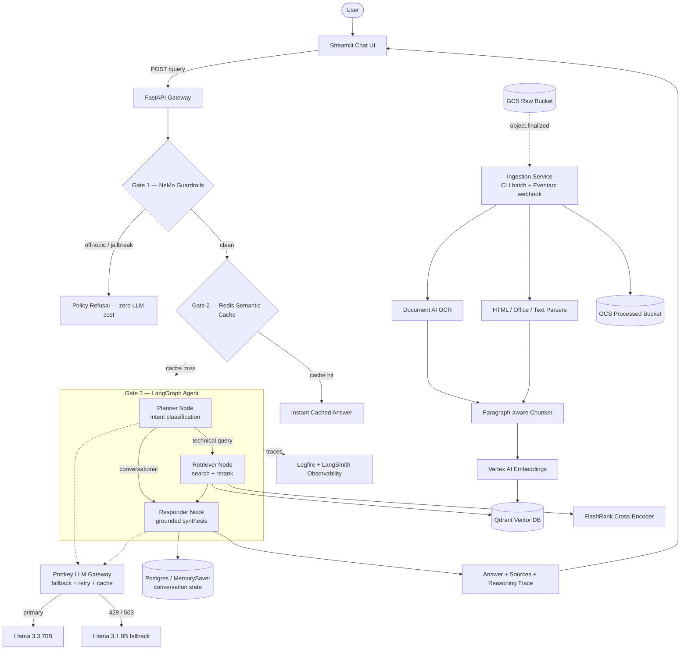

# Enterprise Agentic RAG

A production-grade Retrieval-Augmented Generation platform built on **LangGraph**, deployed on **Google Cloud Run**, and hardened with guardrails, semantic caching, cross-encoder reranking, and a full RAGAS-based evaluation harness.

This isn't a single prompt-and-retrieve script — it's a multi-stage agentic pipeline with its own LLM gateway (fallback + retry + caching), a topic-scoped safety layer, dual-mode document ingestion (batch + event-driven), persistent conversational memory, and end-to-end observability across every hop of every request.

<p>
  
  
  
  
  
  
</p>

---

## Architecture



---

## Why this isn't a toy RAG demo

| Concern | How it's handled |
|---|---|
| **LLM provider outages / rate limits** | Every LLM call is routed through a **Portkey gateway** with a saved fallback strategy (primary → smaller model), automatic retry on `429`/`503`, and gateway-level response caching — configured centrally, not hardcoded per call site. |
| **Off-topic / adversarial input** | A **NeMo Guardrails** gate (Colang flows) runs *before* the agent graph, refusing off-topic and jailbreak attempts without spending a single retrieval or generation token. |
| **Repeated / near-duplicate questions** | A **Redis semantic cache** compares query embeddings by cosine distance and returns cached answers in milliseconds — skipping the entire LangGraph invocation. |
| **Noisy vector search results** | Retrieval is two-stage: **Qdrant** returns the top-15 nearest neighbors, then a **FlashRank cross-encoder** reranks and keeps only the top-5 — trading raw recall for precision before the LLM ever sees the context. |
| **Multi-turn conversations** | Agent state is checkpointed via LangGraph's `PostgresSaver` (Cloud SQL) in production, with automatic fallback to in-memory checkpointing if the DB is unreachable — so a bad DB connection degrades gracefully instead of crashing the service. |
| **Large PDFs / scanned documents** | Ingestion uses **Google Document AI** for OCR-quality PDF parsing, automatically splitting documents over 15 pages into synchronous-API-safe chunks. |
| **Ingestion feedback loops** | The ingestion service is bucket-isolated by design: it's triggered by GCS `object.finalized` events on a **raw** bucket and only ever writes to a separate **processed** bucket — so it can never re-trigger itself. |
| **"Does it actually work?"** | A dedicated **evaluation suite** scores every response against a golden dataset using RAGAS (Faithfulness, Relevancy, Context Precision/Recall, Answer Correctness) plus a binary guardrails precision/recall harness — not vibes-based QA. |
| **"What happened on that request?"** | Every node, retrieval call, rerank pass, and guardrail decision is wrapped in a **Logfire** span, with parallel tracing through **LangSmith** for the LangGraph execution itself. |

---

## How a request actually flows

1. **Streamlit UI** posts the user's message to `POST /query` on the FastAPI backend, along with a `thread_id` for conversational continuity.
2. **Gate 1 — Guardrails**: the message is checked against Colang-defined flows (off-topic, jailbreak, greeting, capabilities, farewell). A firing rail short-circuits the request immediately with a canned, on-brand refusal — no downstream cost.
3. **Gate 2 — Semantic cache** *(optional, env-flagged)*: the query is embedded and compared against cached entries by cosine distance; a near-duplicate of a previously-answered question returns instantly.
4. **Gate 3 — LangGraph agent**:
   - **Planner** reads the full conversation history and classifies the latest message as `CONVERSATIONAL` (answerable from memory alone) or a refined technical **search query**.
   - Conversational turns route straight to the **Responder**; technical turns route through the **Retriever** first.
   - **Retriever** embeds the query, pulls the top-15 candidates from Qdrant, reranks them with a local FlashRank cross-encoder, and keeps the top 5 — formatted and capped at ~25k characters to stay inside model TPM limits.
   - **Responder** synthesizes the final answer from retrieved context *and* conversation history, via the Portkey-routed Groq model.
5. Conversation state is checkpointed (Postgres in production, in-memory locally), and the response — answer, sources, and the planner's reasoning trace — is returned to the UI.
6. Successful technical answers are written back into the semantic cache with a TTL for future hits.

---

## Retrieval & Ingestion pipeline

Documents flow through a **dual-mode ingestion service** (`app/ingestion/processor.py`) that runs identically whether triggered manually or by cloud events:

- **CLI batch mode** — `python -m app.ingestion.processor DATA/` scans a directory tree, auto-classifies subfolders as source types, uploads originals to a raw GCS bucket, then processes them.
- **Cloud event mode** — the same service exposes a FastAPI webhook designed for GCS Eventarc triggers (`object.finalized`), processing newly-uploaded files without re-touching the raw bucket, so it never creates an infinite trigger loop.

Per-format parsing is dispatched by extension:

| Format | Parser |
|---|---|
| PDF | Google Document AI (auto-chunked at 15 pages per sync request) |
| HTML | BeautifulSoup, script/style/meta stripped |
| DOCX / PPTX | `unstructured` partitioning |
| TXT | Direct read |

Extracted text is split by a paragraph-aware chunker, embedded in batches via **Vertex AI `text-embedding-004`**, and upserted into a **Qdrant** collection (768-dim, cosine distance) with source metadata for citation.

---

## Evaluation suite

A golden-dataset-driven eval harness (`evals/`) validates the live system end-to-end — not mocked components:

**Phase 1 — Live pipeline.** Every golden question is sent to the running `/query` endpoint. Long answers are summarized (not truncated) by a separate judge-only Groq key, preserving factual claims for accurate scoring while keeping token usage low.

**Phase 2 — RAGAS scoring**, run with exponential backoff against Groq rate limits so a full sweep always completes:

| Metric | What it validates |
|---|---|
| Faithfulness | The answer doesn't hallucinate claims absent from retrieved context |
| Answer Relevancy | The answer actually addresses the question asked |
| Context Precision | Retrieved chunks are relevant and well-ranked |
| Context Recall | Retrieval surfaced everything needed to answer correctly |
| Answer Correctness | Semantic + factual alignment with the ground-truth reference |
| Tool Correctness | The planner routed to the right path (retrieval vs. direct answer vs. guardrail), scored by Jaccard similarity |

**Guardrails eval** runs adversarial and legitimate inputs against the live API and classifies each as TP / TN / FP / FN, producing precision, recall, and accuracy.

Results are persisted to GCS with run history and score trends, browsable through a dedicated Streamlit dashboard (`evals/app.py`) — ground truth review, live run execution, and historical comparison in one place.

---

## Observability

Every layer emits structured traces:

- **Logfire** — spans wrap every node (planner, retriever, reranker, responder), every guardrail check, every gateway call, and every ingestion step, with human-readable span names for fast debugging.
- **LangSmith** — native tracing for the LangGraph execution graph itself.
- **Portkey dashboard** — request-level visibility into which model actually served each call (primary vs. fallback), cache hit/miss status, and retry behavior.

---

## Tech stack

| Layer | Technology |
|---|---|
| Agent orchestration | LangGraph (stateful, cyclic graph with conditional routing) |
| API layer | FastAPI + Uvicorn |
| LLM gateway | Portkey (OpenAI-compatible proxy, fallback + retry + cache) |
| LLM inference | Groq (Llama 3.3 70B primary / Llama 3.1 8B fallback) |
| Guardrails | NVIDIA NeMo Guardrails (Colang flows) |
| Vector database | Qdrant |
| Reranking | FlashRank (local ONNX cross-encoder) |
| Embeddings | Google Vertex AI (`text-embedding-004`) |
| Document parsing | Google Document AI, Unstructured, BeautifulSoup |
| Conversational memory | LangGraph `PostgresSaver` (Cloud SQL) / in-memory fallback |
| Semantic cache | Redis (Memorystore) |
| Evaluation | RAGAS, custom guardrails precision/recall harness |
| Observability | Logfire, LangSmith |
| Frontend | Streamlit |
| Deployment | Docker, Google Cloud Run, Cloud Build, VPC connector |

---

## Project structure

```
app/
├── agents/
│   ├── graph.py              # LangGraph wiring, conditional routing, checkpointer selection
│   ├── state.py               # Shared agent state schema
│   └── nodes/
│       ├── planner.py         # Intent classification (conversational vs. technical)
│       ├── retriever.py       # Vector search + cross-encoder reranking
│       └── responder.py       # Context-grounded answer synthesis
├── gateway/
│   └── client.py               # Portkey-backed LLM client (fallback/retry/cache)
├── guardrails/
│   ├── colang_rules.py         # Off-topic, jailbreak, greeting, capability flows
│   └── rails.py                 # NeMo Guardrails runtime wrapper
├── ingestion/
│   ├── processor.py             # Dual-mode ingestion (CLI batch + Eventarc webhook)
│   ├── loaders/                  # PDF / HTML / Office / text parsers
│   └── chunking/                 # Paragraph-aware chunker
├── services/
│   ├── retrieval/                # Qdrant search, embeddings, reranking
│   └── gcp/                       # Postgres pool, Redis semantic cache
└── main.py                        # FastAPI app — guardrails → cache → agent

evals/
├── app.py                 # Streamlit evaluation dashboard
├── pipeline.py             # Live pipeline runner
├── metrics.py               # RAGAS scoring (6 experiments)
├── guardrails_eval.py        # Guardrails TP/TN/FP/FN scoring
└── golden_dataset.json         # Ground-truth Q&A + guardrails test cases

ui/
├── app.py                 # Local Streamlit chat client
└── st_cloud_ui.py           # Cloud-deployed Streamlit client
```

---

## Running it locally

```bash
python -m venv venv
.\venv\Scripts\activate        # Windows
source venv/bin/activate       # macOS/Linux

pip install -r requirements.txt
```

Create a `.env` file with the variables below (see `Settings` in `app/config.py` for the full list and defaults):

| Variable | Purpose |
|---|---|
| `PROJECT_ID`, `LOCATION` | GCP project + region |
| `GCP_DOC_AI_PROCESSOR_ID` | Document AI processor for PDF OCR |
| `GCP_RAW_BUCKET`, `GCP_PROCESSED_BUCKET` | GCS buckets for ingestion |
| `QDRANT_URL`, `QDRANT_API_KEY` | Vector database |
| `GROQ_API_KEY`, `JUDGE_GROQ` | Inference key (prod) and isolated eval-judge key |
| `PORTKEY_API_KEY`, `PORTKEY_CONFIG_ID` | LLM gateway routing config |
| `LOGFIRE_TOKEN`, `LANGSMITH_API_KEY` | Observability |
| `DB_HOST`, `DB_USER`, `DB_PASS`, `DB_NAME` | Postgres checkpointing (optional — falls back to in-memory) |
| `REDIS_HOST`, `REDIS_PORT`, `USE_SEMANTIC_CACHE` | Semantic cache (optional) |

Ingest documents, then start the stack:

```bash
# Index everything under DATA/
python -m app.ingestion.processor DATA --wipe

# Backend
uvicorn app.main:app --reload --port 8000

# Chat UI
streamlit run ui/app.py

# Evaluation dashboard
streamlit run evals/app.py
```

---

## Deployment

Containerized with a slim `Dockerfile` and shipped via **Google Cloud Build → Artifact Registry → Cloud Run**, with a VPC connector for private Cloud SQL access and IAM-scoped service accounts per resource (Document AI, Storage, AI Platform). The ingestion service's Eventarc-webhook mode means it's ready to run as an event-driven Cloud Run service off GCS uploads with no code changes — just infrastructure wiring.
